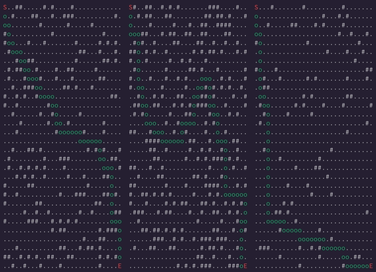

# Seastar

<!-- markdownlint-disable -->
<div align="right">
<a href="https://crates.io/crates/seastar">
    
</a>
<a href="https://docs.rs/seastar/latest/seastar/">
    
</a>
</div>
<br>
<div align="center">
    
</div>
<!-- markdownlint-enable -->

---

## Features

`seastar` is a dependency-free, non-generic implementation of the __[A*
pathfinding](https://en.wikipedia.org/wiki/A*_search_algorithm)__ algorithm. It
is specifically designed to operate over a 2D grid of tiles in cardinal
directions _(North, East, South, West)_.

I can't necessarily recommend using this over the
__[pathfinding](https://github.com/samueltardieu/pathfinding)__ crate, but I
wanted a different API for my own use-case, as well as a deeper understanding of
the algorithm.

## Usage

```sh
cargo add seastar
```

```rust

fn main() {
    // A grid needs to be a 2D vector of `Option`s. `None` represents an
    // empty tile, while `Some(())` represents a blocked tile.
    let grid = vec![
        vec![None, None, Some(())],
        vec![Some(()), None, None],
        vec![None, None, None],
    ]

    let start = Point { x: 0, y: 0 }; // top left corner
    let end = Point { x: 2, y: 2 }; // bottom right corner

    // Assuming a path is found, `path` will be a `Vec<Point>` where each point is
    // a step in the path from `start` to `end`.
    if let Some(path) = astar(&grid, &start, &end) {
        // ...do whatever you want with the path!
    }
}

```

## Examples

If you have cloned the `seastar` repository, you can run an example with the
command `cargo run --example <example_name>`.

<!-- markdownlint-disable -->
| Example | File                                    | Description                                                              | 
|---------|-----------------------------------------|--------------------------------------------------------------------------|
| random_30 | __[random_30.rs](/examples/random_30.rs)__   | Generate a 30x30 map with random walls and a random start and end point. |                    
| random_100 | __[random_100.rs](/examples/random_100.rs)__   | Generate a 100x100 map with random walls and a random start and end point. |
<!-- markdownlint-enable -->

## Benchmarks

You can run benchmarks with the command `cargo bench`.

__NOTE:__ A word of caution about benchmarks here: because the maps are randomly
generated in the bench tests, the results will vary greatly from run to run.
Maps without valid paths are often outliers that can skew the results heavily,
especially on larger grids.

## License

Seastar is dual-licensed under either

- __[MIT License](/docs/LICENSE-MIT)__
- __[Apache License, Version 2.0](/docs/LICENSE-APACHE)__

at your option.
